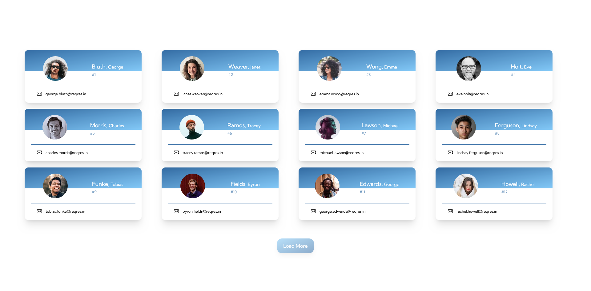

# User list

This NEXT.js app is a response made by Evelan to assess my REACT and frontend skills. I've considered many factors on creating this web application. First is to have the display be as responsive as possible. Second, make the fetching of data through the API as fast and as dynamic as possible. Right now, the API only has a total number of 2 pages with 6 users per page. But the way I've coded the web application is that it will make multiple request until the API no longer returns a value, this will make sure that if the API adds another page, the web application would still be able to fetch the newly-added data.

## Table of contents

- [Overview](#overview)
  - [Screenshot](#screenshot)
  - [Links](#links)
- [My process](#my-process)
  - [Built with](#built-with)
  - [Useful resources](#useful-resources)
- [Author](#author)

## Overview

### Screenshot

### Links

- Solution URL: [Solution URL here](https://github.com/awesooomeME/users)
- Live Site URL: [Live site URL here](https://users-red.vercel.app/)

## My process

### Built with

- Semantic HTML5 markup
- CSS custom properties
- Flexbox
- [React](https://reactjs.org/) - JS library
- [Next.js](https://nextjs.org/) - React framework
- [Tailwind](https://https://tailwindcss.com//) - For styles

### Useful resources

- [resource 1](https://swr.vercel.app/docs/pagination) 
    - Great Reference for the use of useSWR

- [resource 2](https://livebook.manning.com/book/next-js-in-action/welcome/v-2/) 
    - Great book for React introduction

## Author

- Github - [awesooomeME](https://github.com/awesooomeME)
- Frontend Mentor - [@awesooomeME](https://www.frontendmentor.io/profile/awesooomeME)